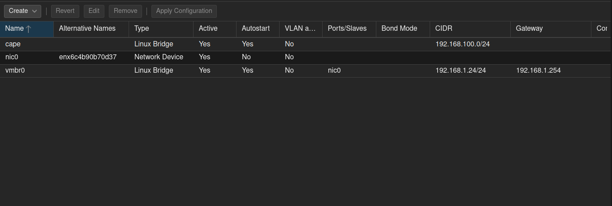
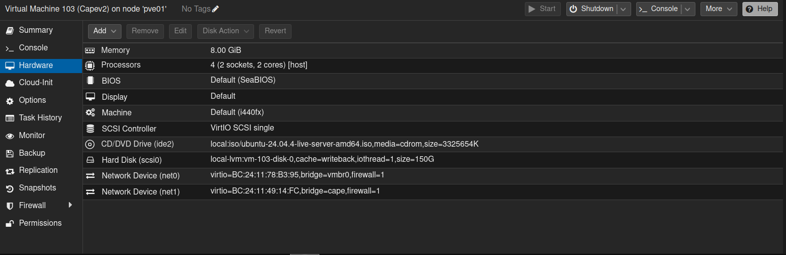
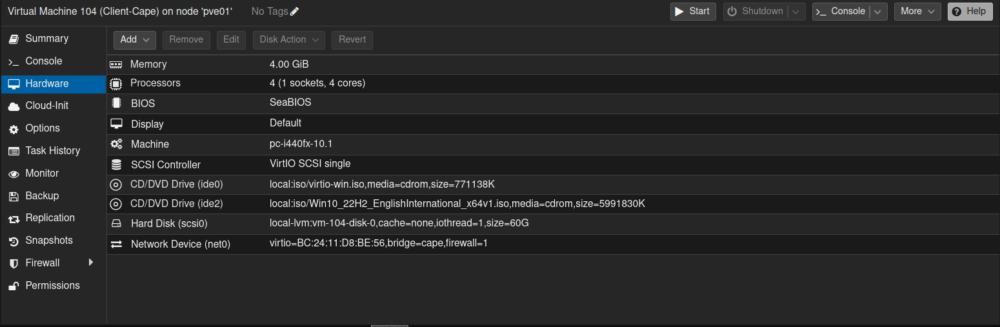

Guide to a Proxmox installation of Cape2

I will do my best to share information on how to install Cape2, as I ran into lots of issues it. The documentation being mostly lacking in the configuration, I'll share also my configuation files and a small compendium of aliases to work faster. Hope this helps :)


There being lots of moving parts, I ran into some issues others did not and did not run in issues others did. Good luck o7


I didn't use https://github.com/rebaker501/capev2install as it didn't focus on the Proxmox side of things, but check it out ! The information regarding the acpi and setup of the Windows VM (which I haven't had time to test out yet but will check out) should be very helpful :D

# Proxmox 


You can add the flags aes-enc and nested-virt to do everything in a VM, but that'd be missing out on Proxmox abilities as it should sit on bare metal. 

For this setup, you'll need 1 VM to host the Cape server, and at least 1 VM to be a client. I used a Ubuntu 24.04 noble VM as the host and the client will be a Win 10 "Home".

I now think I could've use an LXC instead of a VM for the Cape2 server, but for my purposes should be a bit more secure.

During the down times of the installation (there will be many..), I recommened confugrating the stuff right down.

### User

You should create a new user specifically for the Cuckoo tasks. On my end, I created the user "cuckoo" within the realm "pve". Note down the password then put it inside the config file of proxmox.conf.

### Network 

My main proxmox setup sits at 192.168.1.24. The ubuntu VM will be at 192.168.1.103 and 192.168.100.100. Windows VM will be 192.168.100.200.

The point of the second network is to separate as much as possible the malware testing server from the rest of the network.



### Ubuntu VM

If you're going to do nested-virt, I've read SeaBIOS / Legacy BIOS being preferred. 150Go is WAYYY overkill, the current working setup needs ~10Go. I recommend doing backups often, I did not have to go back at any time, but eh.



### Win VM

Nothing much here, remember to add the VirtIO Drivers for the ethernet interface setup. 60GO is also overkill, currently using ~10Go.




# Installation


## Cape 2
If you're going to do virtualisation on the Cape server, here's what you should install (Took about 1 hour but wasn't needed as I decided right afterwards to use Proxmox to host clients).

https://github.com/kevoreilly/CAPEv2/blob/master/installer/kvm-qemu.sh
```bash
sudo chmod a+x kvm-qemu.sh
sudo ./kvm-qemu.sh all capev2 | tee kvm-qemu.log
sudo ./kvm-qemu.sh virtmanager capev2 | tee kvm-qemu-virt-manager.log
```


To install Cape2 :

https://github.com/kevoreilly/CAPEv2/blob/master/installer/cape2.sh
```bash
   65  chmod a+x ./cape2.sh
   68  sudo ./cape2.sh all 192.168.1.103 | tee cape2.log
```

The configuration for Cape2 sits at `/opt/CAPEv2/conf/, and in my use case I only needed to modify cuckoo.conf and proxmox.conf.

The installation was missing mongod :

```bash
# On the PROXMOX HOST
qm shutdown <103
qm set 103 --cpu host
qm start 103
```
```bash
# On Cape server

# Verify that avx and avx2 are there
grep -o 'avx[^ ]*' /proc/cpuinfo | sort -u

# If  they are : 
# Import MongoDB GPG key
curl -fsSL https://www.mongodb.org/static/pgp/server-8.0.asc | \
  sudo gpg -o /usr/share/keyrings/mongodb-server-8.0.gpg --dearmor

# Add the Noble (24.04) repo
echo "deb [ arch=amd64,arm64 signed-by=/usr/share/keyrings/mongodb-server-8.0.gpg ] \
  https://repo.mongodb.org/apt/ubuntu noble/mongodb-org/8.0 multiverse" | \
  sudo tee /etc/apt/sources.list.d/mongodb-org-8.0.list

# Install
sudo apt-get update
sudo apt-get install -y mongodb-org

# Enable and start
sudo systemctl enable mongod --now
sudo systemctl status mongod

# Confirm it no longer crashes
mongod --version
```

Also had to install proxmoxer : 

```bash
cd /opt/CAPEv2
sudo -u cape /etc/poetry/bin/poetry run pip install proxmoxer requests -U
```

After a config change, it was easier for me to just sudo reboot every time to make sure it was taken into account.


# Windows VM

Download the ISO for the appropriate Windows. I went for win 10 as it's the most easy to setup without lots of bloatware like Win 11 has.

For my purposes, I haven't yet enabled internet access, but it would be most trivial. A next section of this tutorial comprises the firewall rules I have setup to minimize the attack surface if any virus were able to breach containment.


After installation, go for a python version >3.9 and <3.13. Here's how I sent the files (agent.py, gotten from `/opt/CAPEv2/agent/agent.py`)

```bash
# On Cape server
mkdir send-file && cd send-file
wget https://www.python.org/ftp/python/3.11.9/python-3.11.9.exe
cp /opt/CAPEv2/agent/agent.py ./agent.py
python -m http.server 8888
```


```powershell
# On the Win VM
Invoke-WebRequest -Uri 'http://192.168.100.100:8888/agent.py' OutFile agent.py
```

As the agent.py should be ran as an administrator, the recommended way is via a scheduled task set on activating on boot. I exported the task I made and put it at `conf/ScheduledTask.conf` (user is SYSTEM obv).


Will continue soon™
